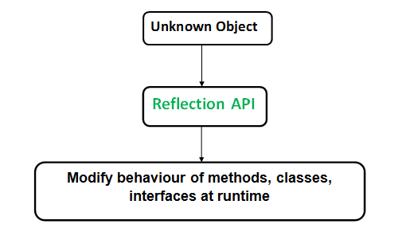

# Annotations in Java

Java supports a feature called annotations which is used for presenting some data/details on different spots in your code.

## Annotation Types

These annotations have two types :
1. Predefined in java.
2. User-defined annotations

`annotations types are just like functions`

9 general purpose.

Four are imported from java.lang.annotation: 
@Retention, @Documented, @Target, and @Inherited. 

Other five are
@Override, @Deprecated, @FunctionalInterface, @SafeVarargs, and @SuppressWarnings are included in java.lang.

## Some of Built-in Annotations


@Override: 
informs you that this is a second time writing/updating (overriding) a method so if you misspelled its name or whatsoever the compiler will give an error.

@Deprecated:
informs you that this what you're trying to use i.e.(method, class, or an operator etc ...) is deprecated and may not be supported in the upcoming versions of the labguage.

@FunctionalInterface:
informs you that this is a functional interface (which contains one and only one astract method with no body to be implemented)so that if you made another one it will a give an error.

and the list continuous ...

## User-defined Annotations

is the annotations the user has declared (custom ones)

#### Annotation Declaration

Annotations can be declared just interfaces

```
@interface AnnotationName{
    
    // Mandatory data to be passed when calling the annotation
    int id;
    String name;

    // Optional data
    int salary default 999999;
    String [] phones default { "68485431" , "31687956" }
}
```

it takes a name and its body contains some properties/fields look like method signature but in fact it's just like normal properties.

## Retention Policy

we can specify how to treat these annotations either:
1. Before compile time => SOURCE  
The defined annotation will be ignored by the compiler when building the code. So the annotation is only available in the source code, and not in the .class files, and not at runtime too.
2. During compilation => CLASS (default one)  
(meaning after .class files have been created)  
Annotations with RetentionPolicy.CLASS will be retained till code compilation but are discarded during the runtime. Annotations with CLASS will be written to byte code but will be discarded during the class loading time that makes it unavailable during runtime.

3. In the run time  => RUNTIME  
Annotations marked with RetentionPolicy.RUNTIME are kept around until runtime, meaning they’ll be accessible in the runtime, source code, and class files.

## Annotation Elements

Annotation can be put on any element type:

The ElementType class contains the following possible targets:

1. ElementType.ANNOTATION_TYPE
2. ElementType.CONSTRUCTOR
3. ElementType.FIELD           => means (on the member level [property])
4. ElementType.LOCAL_VARIABLE
5. ElementType.METHOD
6. ElementType.PACKAGE
7. ElementType.PARAMETER
8. ElementType.TYPE        => means (class, enum, interface, etc ...)
9. ElementType.TYPE_PARAMETER
10. ElementType.TYPE_USE


## Annotation properties/fields

These are the examples of the elements within the annotation declaration either mandatory or optional (having default value):

```
    // Mandatory data to be passed when calling the annotation
    int id;
    String name;

    // Optional data
    int salary default 999999;
    String [] phones default { "68485431" , "31687956" }
```

## Reflection API

Java Reflection is a process of examining or modifying the run time behavior of a class at run time.

The java.lang.Class class provides many methods that can be used to get metadata, examine and change the run time behavior of a class.

The java.lang and java.lang.reflect packages provide classes for java reflection.



